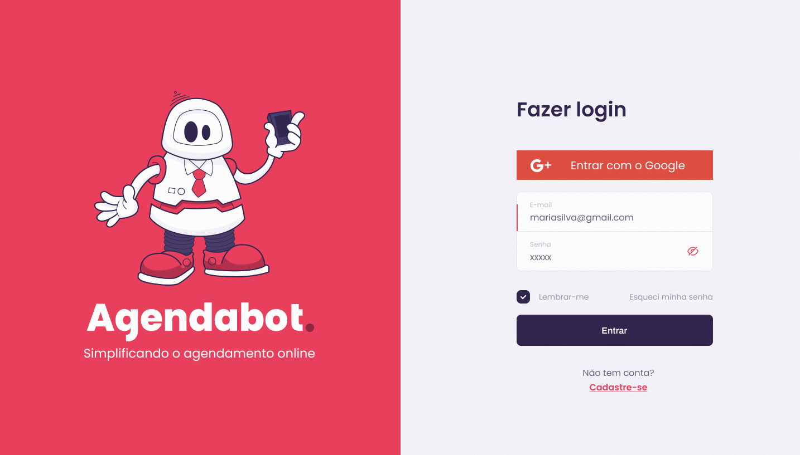

<h5 align=center>
 

</h5>

## 🔖 Sobre

O Agendabot é um bot de Whatsapp que sincroniza com a agenda de Pequenos Prestadores de Serviços para simplificar o agendamento de sessões com os seus clientes.

## 💻 Preview

## Equipe

- 🎨 UX/Frontend: [Adriana Lima](https://www.linkedin.com/in/adrianalimashika/)
- 💼 Bussiness: [Adriane Schneider](https://www.linkedin.com/in/adrischneider/)
- 🖥 Backend: [Kamila Santos](https://www.linkedin.com/in/kamila-santos-oliveira/)
- 📢 Marketing: [Renata de Freitas](https://www.linkedin.com/in/reldefreitas/)

## 📥 Executar esse projeto no seu computador

- Clonar Repositório: `git clone https://github.com/dxwebster/Agendabot-Frontend.git`
- Ir para a pasta: `cd Agendabot-Frontend`
- Instalar dependências: `yarn install`
- Rodar Aplicação: `yarn start`

## 📕 Licença

Todos os arquivos incluídos aqui, incluindo este _Readme_, estão sob [Licença MIT](./LICENSE). 
Criado com ❤ por Time 10 - Hackaton Zenvia New Horizon
